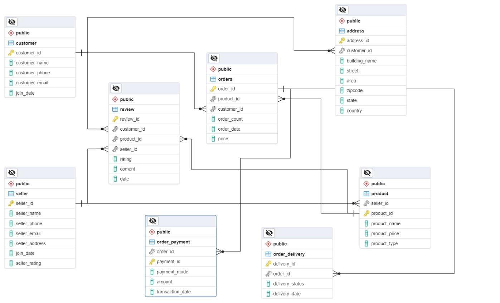

# Product_Dissection

## Project Overview
A case study that picks apart how Amazon's platform actually works, then designs a relational schema to back the features that make it work.

## Tools
dbdiagram.io for the ER diagram; conceptual schema design done manually based on Amazon's public-facing feature set.

## The schema

Eight entities, built around the customer → order → payment/delivery → review lifecycle:
 
| Entity | Purpose |
|---|---|
| `Customer` | Core customer profile (name, phone, email, join date) |
| `Address` | Customer address, linked 1-to-many from Customer |
| `Seller` | Seller profile, including a `seller_rating` field |
| `Product` | Product catalog, linked to the seller that lists it |
| `Order` | Order header — links customer, product, quantity, date |
| `Order_delivery` | Delivery status and date per order |
| `Order_payment` | Payment mode, amount, and transaction date per order |
| `Review` | Customer review of a product, tied to both the product and the seller |
 
**Key relationships:**
- A customer can have many addresses, orders, and reviews
- A seller can list many products and receive many reviews across them
- Each order has exactly one payment record and one delivery record
- Products and orders are many-to-many (through order line items)

## Note on scope
 
This is a conceptual data-modeling exercise — reasoning about what a relational schema for Amazon's core features would look like from the outside, not a build against Amazon's actual production database (which obviously isn't public). It doesn't include implementation-level detail like specific constraints, indexing strategy, or SQL injection mitigations — if I extend this, adding an actual `CREATE TABLE` script with constraints and a short section on how parameterized queries would protect these tables would be a good next step.
